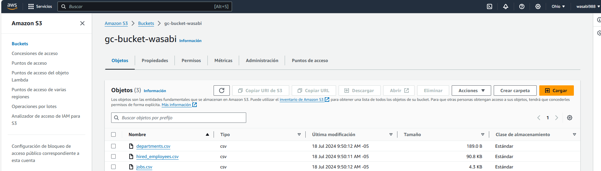
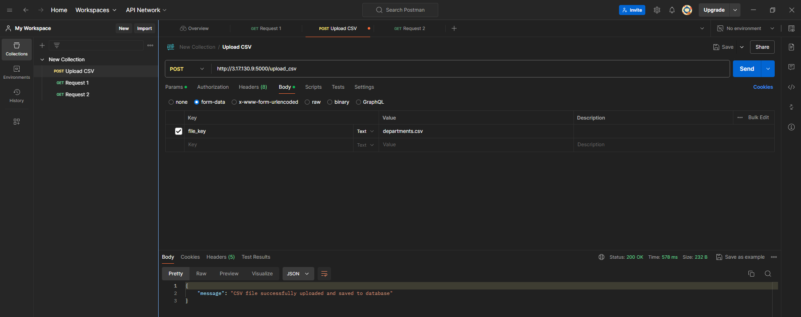
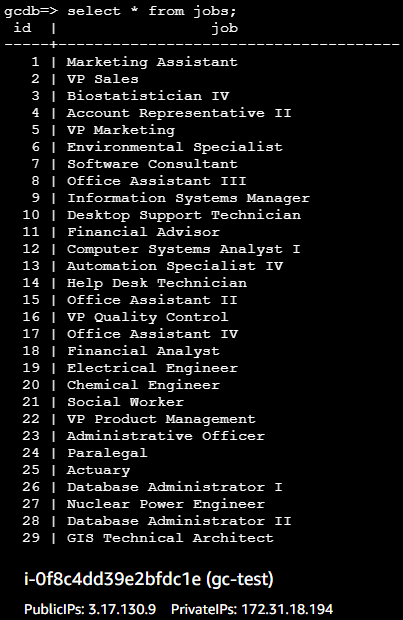
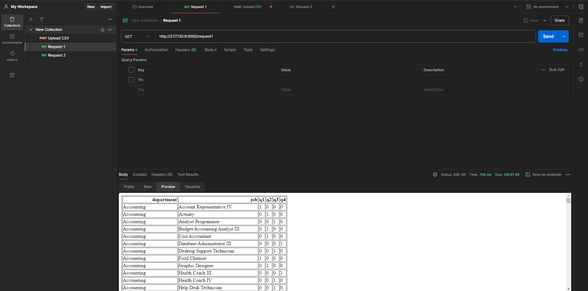
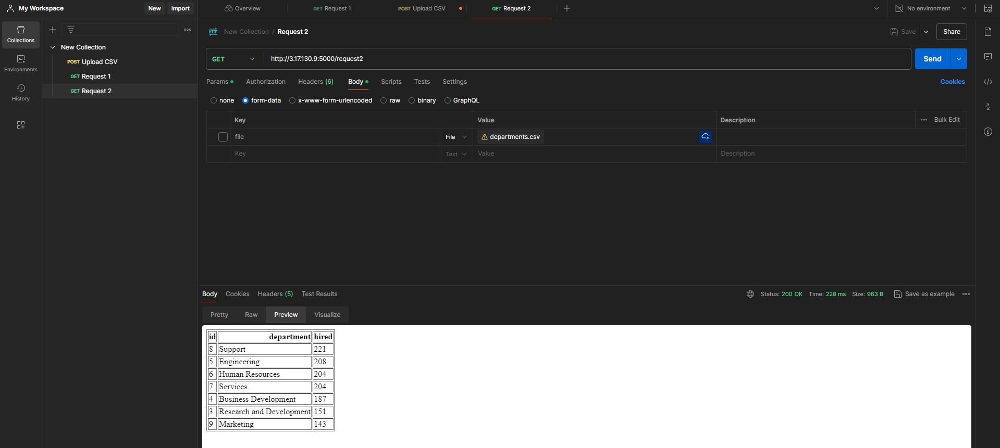
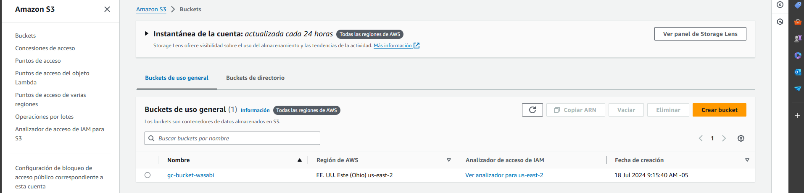
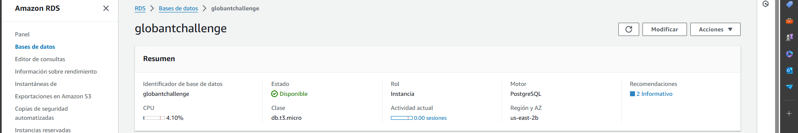
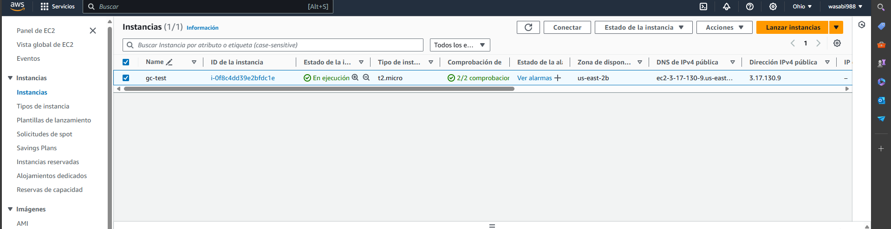
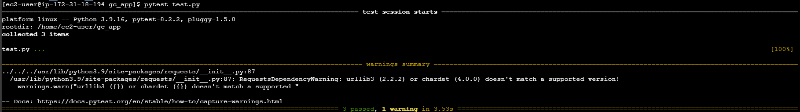
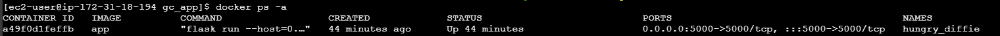

# ChallengeGlobant
Repositorio para almacenamiento de modulos para challenge Globant

## Upload CSV
Se generó el endpoit upload_csv que permite escribir el nombre de un archivo el cual se llevará desde un almacenamiento s3 hacia una base de datos de postgre

A través de postman se ejecutó el llamado al endpoint con la acción POST

Finalmente se puede ver el resultado en la base de datos

## Requests

Tal cual se especifica en el ejercicio se creó un endpoint para cada unas de las querys.

### Request1

A través de postman se ejecutó el llamado al endpoint con la acción GET

### Request2

A través de postman se ejecutó el llamado al endpoint con la acción GET

## Despliegue en AWS

Se utilizó la capa gratuita de AWS para el despliegue de la solución.

### Almacenamiento

Se utilizó S3 para el almacenamiento de los archivos CSV

### Base de datos

Se utilizó una instancia de RDS para la base de datos utilizando POSTGRE como tipo de base de datos.

### Maquina virtual

Se utilizó una instancia ec2 para ejecutar el script de python.

## Dockerización y Tests

### Tests

Se utilizó la librería pytest para testear los 3 endpoints creador anteriormente.

### Dockerización

Finalmente se creó la imagen y se ejecutó desde la instancia ec2. Los resultados vistos inicialmente pertenecen justamente a la ejecución desde el contenedor.

